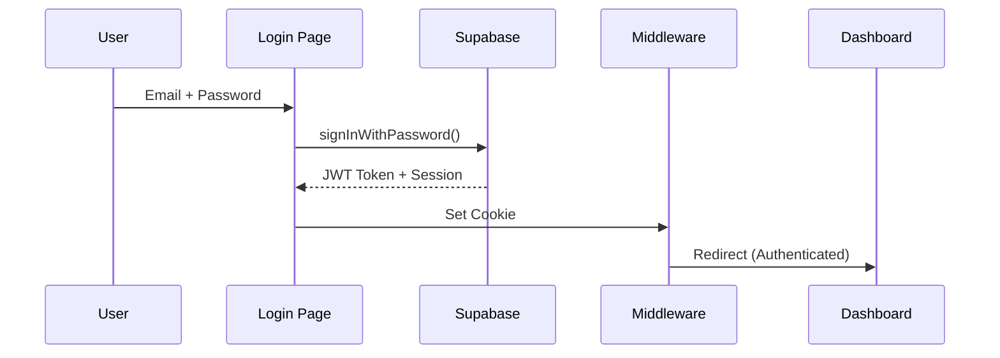

# 🏗️ PotentiaMX - Análisis Técnico Completo

**Plataforma SaaS para Tours Virtuales 360° en Bienes Raíces**

> Documento técnico para desarrolladores, programadores y colaboradores técnicos

---

## 📋 Tabla de Contenidos

1. [Resumen Ejecutivo](#resumen-ejecutivo)
2. [Arquitectura del Sistema](#arquitectura-del-sistema)
3. [Stack Tecnológico](#stack-tecnológico)
4. [Estructura del Proyecto](#estructura-del-proyecto)
5. [Módulos y Funcionalidades](#módulos-y-funcionalidades)
6. [Flujos de Usuario](#flujos-de-usuario)
7. [Base de Datos](#base-de-datos)
8. [Autenticación y Seguridad](#autenticación-y-seguridad)
9. [Optimizaciones de Performance](#optimizaciones-de-performance)
10. [APIs y Servicios](#apis-y-servicios)
11. [Deployment y CI/CD](#deployment-y-cicd)
12. [Roadmap y Próximas Mejoras](#roadmap-y-próximas-mejoras)

---

## 🎯 Resumen Ejecutivo

### ¿Qué es PotentiaMX?

PotentiaMX es una **plataforma SaaS B2B** que permite a agentes inmobiliarios crear, gestionar y compartir **tours virtuales 360°** de propiedades inmobiliarias con optimización SEO para posicionamiento en Google.

### Propuesta de Valor

- **Para Agentes**: Crear tours 360° sin conocimientos técnicos, con SEO automático
- **Para Compradores**: Experiencia inmersiva de visita virtual desde cualquier dispositivo
- **Para el Negocio**: SaaS escalable con modelo freemium y analytics integrados

### Métricas Clave de Performance

| Métrica | Valor | Benchmark |
|---------|-------|-----------|
| **Lighthouse Score** | 90+ | >90 (Good) |
| **LCP (Largest Contentful Paint)** | <2.5s | <2.5s (Good) |
| **TTFB (Time to First Byte)** | <100ms | <200ms (Good) |
| **Bundle Size (Initial)** | ~240KB | <300KB (Good) |

---

## 🏛️ Arquitectura del Sistema

### Arquitectura General

```
┌─────────────────────────────────────────────────────────┐
│                     CLIENT SIDE                         │
│  ┌─────────────┐  ┌──────────────┐  ┌───────────────┐ │
│  │  Next.js 15 │  │ React 19.1.0 │  │ Tailwind CSS  │ │
│  │  App Router │  │  Client/RSC  │  │   4.1.14      │ │
│  └─────────────┘  └──────────────┘  └───────────────┘ │
└─────────────────────────────────────────────────────────┘
                           ↕
┌─────────────────────────────────────────────────────────┐
│                    SERVER SIDE                          │
│  ┌──────────────────────────────────────────────────┐  │
│  │         Next.js API Routes + Middleware          │  │
│  │  - Authentication (Supabase Auth)                │  │
│  │  - Session Management (SSR Cookies)              │  │
│  │  - Analytics API (PostHog Integration)           │  │
│  │  - Contact Form (Resend Email)                   │  │
│  └──────────────────────────────────────────────────┘  │
└─────────────────────────────────────────────────────────┘
                           ↕
┌─────────────────────────────────────────────────────────┐
│                   BACKEND SERVICES                      │
│  ┌──────────────┐  ┌────────────┐  ┌────────────────┐ │
│  │  Supabase    │  │  PostHog   │  │    Resend      │ │
│  │  - Auth      │  │  Analytics │  │    Email API   │ │
│  │  - Database  │  │  Events    │  │                │ │
│  │  - Storage   │  │            │  │                │ │
│  └──────────────┘  └────────────┘  └────────────────┘ │
└─────────────────────────────────────────────────────────┘
```

### Patrón de Arquitectura

**Tipo**: Jamstack + SaaS Multi-Tenant

**Características**:
- **Frontend**: Static Generation (SSG) + Incremental Static Regeneration (ISR)
- **Backend**: Serverless Functions (Next.js API Routes)
- **Database**: PostgreSQL (Supabase)
- **Storage**: Object Storage (Supabase Storage)
- **Auth**: JWT + Session Cookies (Supabase Auth)

---

## 🛠️ Stack Tecnológico

### Frontend Stack

```javascript
// Core Framework
Next.js 15.5.4          // React Framework con App Router y Turbopack
React 19.1.0            // UI Library (Client + Server Components)
TypeScript 5.x          // Type Safety

// Styling
Tailwind CSS 4.1.14     // Utility-first CSS Framework
PostCSS 8.5.6           // CSS Transformations
Framer Motion 12.23     // Animations

// 360° Viewer
@photo-sphere-viewer/core 5.14.0           // Core Viewer
@photo-sphere-viewer/markers-plugin        // Interactive Hotspots
@photo-sphere-viewer/gallery-plugin        // Image Gallery
@photo-sphere-viewer/map-plugin            // Minimap GPS
@photo-sphere-viewer/plan-plugin           // Floor Plans

// Maps
Leaflet 1.9.4           // Interactive Maps
React-Leaflet 5.0.0     // React Integration

// UI Components
@headlessui/react 2.2.9 // Unstyled Accessible Components
@heroicons/react 2.2.0  // Icon Library
lucide-react 0.546.0    // Additional Icons

// Utilities
clsx 2.1.1              // Conditional CSS Classes
tailwind-merge 3.4.0    // Merge Tailwind Classes
slugify 1.6.6           // URL-friendly Slugs
uuid 13.0.0             // Unique Identifiers
```

### Backend Stack

```javascript
// Backend as a Service
@supabase/supabase-js 2.58.0  // Supabase Client
@supabase/ssr 0.7.0           // SSR Authentication

// Email Service
resend 6.2.0                  // Transactional Emails
@react-email/render 1.4.0     // Email Templates

// Analytics
posthog-js 1.297.2            // Product Analytics

// Data Visualization
recharts 3.5.0                // Charts Library

// Image Processing
browser-image-compression 2.0.2 // Client-side Compression
```

### Development Tools

```javascript
// Linting & Formatting
eslint 9.37.0
eslint-config-next 15.5.5
prettier 3.6.2

// Build Tools
Turbopack (Next.js 15)  // Fast bundler (default)
```

---

## 📁 Estructura del Proyecto

### Árbol de Directorios

```
landview-app-cms/
│
├── app/                          # Next.js App Router
│   ├── (routes)/
│   │   ├── page.tsx             # Landing Page (Optimizada)
│   │   ├── login/               # Authentication
│   │   ├── signup/              # Registration
│   │   ├── dashboard/           # Admin Dashboard
│   │   │   ├── page.js          # Properties List
│   │   │   ├── add-terrain/     # Create Property
│   │   │   ├── edit-terrain/    # Edit Property
│   │   │   ├── analytics/       # Analytics Dashboard
│   │   │   └── storage-cleanup/ # Admin Tools
│   │   ├── terreno/[slug]/      # Public Tour Viewer
│   │   │   ├── page.js          # Tour Page
│   │   │   ├── PhotoSphereViewer.js  # 360° Viewer
│   │   │   └── editor/          # Hotspot Editor
│   │   ├── propiedades/         # Property Listings
│   │   ├── legal/               # Legal Pages
│   │   └── servicios-captura/   # Capture Services
│   │
│   ├── api/                     # API Routes
│   │   ├── analytics/           # Analytics Endpoints
│   │   ├── contact/             # Contact Form
│   │   └── create-demo-tour/    # Demo Creation
│   │
│   ├── providers/               # Context Providers
│   │   └── PostHogProvider.tsx  # Analytics Provider
│   │
│   ├── layout.tsx               # Root Layout
│   ├── globals.css              # Global Styles
│   ├── sitemap.ts               # SEO Sitemap
│   └── robots.ts                # SEO Robots.txt
│
├── components/                  # React Components
│   ├── landing/                 # Landing Page Sections
│   │   ├── HeroSection.tsx
│   │   ├── PricingSection.tsx
│   │   ├── ProductTourSection.tsx
│   │   └── ...
│   ├── layout/                  # Layout Components
│   │   ├── Navbar.tsx
│   │   └── Footer.tsx
│   ├── admin/                   # Admin Components
│   └── ...
│
├── lib/                         # Utility Libraries
│   ├── supabaseClient.js        # Supabase Client Setup
│   ├── hotspotsService.js       # Hotspot CRUD
│   ├── polygonsService.js       # Polygon CRUD
│   └── deviceDetection.js       # Device Utils
│
├── scripts/                     # Automation Scripts
│   └── verify-performance-config.js  # Performance Validator
│
├── sql_migrations/              # Database Migrations
│   ├── CREATE_POLYGONS_TABLE.sql
│   └── ...
│
├── public/                      # Static Assets
│   ├── logo-navbar-white.png
│   ├── logo-navbar-black.png
│   └── ...
│
├── middleware.ts                # Next.js Middleware (Auth)
├── next.config.ts               # Next.js Configuration
├── tailwind.config.js           # Tailwind Configuration
├── tsconfig.json                # TypeScript Configuration
└── package.json                 # Dependencies
```

### Convenciones de Archivos

```javascript
// Rutas (App Router)
page.tsx/js         // Página de ruta
layout.tsx/js       // Layout compartido
loading.tsx/js      // Loading UI
error.tsx/js        // Error UI
route.ts/js         // API Route

// Componentes
PascalCase.tsx      // React Component
camelCase.js        // Utility/Service
kebab-case.css      // Styles
```

---

## 🎨 Módulos y Funcionalidades

### 1. **Landing Page** (Marketing)

**Ruta**: `/`

**Tecnología**:
- SSG (Static Site Generation) + ISR (revalidate: 60s)
- Lazy Loading de componentes below-the-fold
- Apple-inspired design system

**Secciones**:
```typescript
Hero Section             // CTA principal
Social Proof            // Partners/Testimonios
Problem/Solution        // Propuesta de valor
Product Tour            // Características (Editor, SEO, Sharing)
Pricing                 // Planes de precio
Testimonials            // Casos de éxito
Contact Form            // Lead generation
Final CTA               // Conversión final
```

**Performance**:
- LCP: <2.5s
- Lazy loading de 7 secciones
- Cache headers optimizados

---

### 2. **Autenticación** (Auth)

**Rutas**: `/login`, `/signup`, `/reset-password`

**Stack**:
```typescript
Supabase Auth           // Backend
JWT + Session Cookies   // Session Management
Email/Password          // Primary Auth
Google OAuth            // Social Login (opcional)
```

**Flow de Autenticación**:



**Seguridad**:
- HTTP-only cookies (CSRF protection)
- Session validation en middleware
- Row Level Security (RLS) en Supabase

---

### 3. **Dashboard** (Admin Panel)

**Ruta**: `/dashboard`

**Funcionalidades**:

#### 3.1 Lista de Propiedades
```typescript
// /dashboard/page.js

Features:
- Grid de propiedades del usuario
- Filtros y búsqueda
- Acciones rápidas (Editar, Eliminar, Ver Analytics)
- Botón "Crear Nueva Propiedad"
- Sistema de permisos (Admin Panel)
```

#### 3.2 Crear Propiedad
```typescript
// /dashboard/add-terrain/page.js

Workflow:
1. Upload de imágenes 360° (múltiples)
2. Compresión automática de imágenes
3. Upload a Supabase Storage
4. Creación de registro en DB
5. Generación de slug SEO-friendly
6. Redirect a Editor de Hotspots

Optimizaciones:
- Compresión client-side (browser-image-compression)
- Validación de formato panorámico
- Preview antes de upload
- Batch upload con progress
```

#### 3.3 Editor de Hotspots
```typescript
// /terreno/[slug]/editor/HotspotEditor.js

Features:
- Vista 360° interactiva (Photo Sphere Viewer)
- Click para agregar hotspots
- Tipos de hotspots:
  - Navigation (ir a otra panorámica)
  - Info (mostrar información)
  - Image (mostrar imagen)
  - Video (reproducir video)
  - Audio (reproducir sonido ambiente/narración)
- Backlinks automáticos (navegación bidireccional)
- Polígonos de área (delimitar zonas)
- Minimap GPS
- Móvil-first UI/UX
```

**Arquitectura del Editor**:

```typescript
// Estado del Editor
const [viewer, setViewer] = useState(null);              // PSV Instance
const [hotspots, setHotspots] = useState([]);            // Hotspots Array
const [currentImageIndex, setCurrentImageIndex] = useState(0);
const [viewNames, setViewNames] = useState([]);          // Custom Names
const [audioSettings, setAudioSettings] = useState({});   // Audio Config

// Flujo de Datos
User Click →
  Get Position (yaw, pitch) →
    Create Hotspot Object →
      Save to Supabase →
        Update Markers in Viewer →
          Create Backlink (if navigation)
```

#### 3.4 Analytics Dashboard
```typescript
// /dashboard/analytics/[slug]/page.tsx

Métricas:
- Pageviews (total de visitas)
- Unique Visitors (visitantes únicos)
- Scene Views (vistas por panorámica)
- Average Time (tiempo promedio por escena)
- Device Breakdown (desktop/mobile/tablet)
- Hot Leads (visitantes >2 min o >5 escenas)
- Heatmap de escenas más visitadas

Integración:
- PostHog Events API
- Gráficos con Recharts
- Filtros por rango de tiempo (7d, 30d, 90d)
- Comparación con período anterior
```

---

### 4. **Tour Viewer** (Public)

**Ruta**: `/terreno/[slug]`

**Componente Principal**: `PhotoSphereViewer.js`

**Features**:

```typescript
// Viewer Capabilities
- 360° Panoramic View (equirectangular images)
- Touch gestures (pinch to zoom, swipe to rotate)
- Gyroscope support (mobile)
- VR mode (opcional)
- Fullscreen mode
- Navigation hotspots
- Info hotspots (tooltips)
- Audio ambiente automático
- Narración por escena
- GPS minimap
- Gallery navigation
- Social sharing

// Plugins Activos
MarkersPlugin      // Hotspots interactivos
GalleryPlugin      // Navegación entre escenas
MapPlugin          // Minimap GPS (estilo DJI drone)
```

**Optimizaciones**:

```typescript
// Performance Optimizations
- Lazy loading de imágenes
- Preload de panorámicas adyacentes
- Image optimization (WebP/AVIF)
- Debounced event handlers
- Memory cleanup en unmount
- Responsive breakpoints
```

**SEO**:

```typescript
// Metadata Dinámica (RSC)
export async function generateMetadata({ params }) {
  const terreno = await getTerreno(params.slug);

  return {
    title: `${terreno.title} | PotentiaMX`,
    description: terreno.description,
    openGraph: {
      images: [terreno.image_urls[0]],
      type: 'website',
    },
    twitter: {
      card: 'summary_large_image',
    }
  }
}
```

---

### 5. **Propiedades** (Listings)

**Ruta**: `/propiedades`

**Sub-rutas**:
- `/propiedades/terrenos`
- `/propiedades/casas`
- `/propiedades/departamentos`

**Features**:
- Grid de propiedades públicas
- Filtros por categoría
- Mapa interactivo (Leaflet)
- Tarjetas de propiedad con preview
- CTA para contacto

---

### 6. **APIs y Servicios**

#### 6.1 Analytics API
```typescript
// /api/analytics/[slug]/route.ts

GET /api/analytics/:slug?timeRange=7d

Response:
{
  pageviews: { current: 150, previous: 120, trend: 25 },
  uniqueVisitors: { current: 85, previous: 70, trend: 21.4 },
  sceneViews: [...],
  averageTime: { current: 145, previous: 120 },
  hotLeads: 12,
  deviceBreakdown: { desktop: 60%, mobile: 35%, tablet: 5% },
  heatmap: [
    { scene: "Entrada", views: 85, visitors: 75 },
    ...
  ]
}
```

#### 6.2 Contact API
```typescript
// /api/contact/route.js

POST /api/contact

Body:
{
  name: string,
  email: string,
  message: string,
  propertyId?: string
}

Flow:
1. Validate inputs
2. Send email via Resend
3. Log to PostHog
4. Return success
```

#### 6.3 Demo Tour API
```typescript
// /api/create-demo-tour/route.js

POST /api/create-demo-tour

- Crea un tour de demostración
- Asigna al usuario actual
- Pre-populated con imágenes de muestra
- Hotspots de ejemplo
```

---

## 🗄️ Base de Datos

### Esquema Supabase PostgreSQL

#### Tabla: `terrenos` (Propiedades)

```sql
CREATE TABLE terrenos (
  id UUID PRIMARY KEY DEFAULT uuid_generate_v4(),
  user_id UUID REFERENCES auth.users(id) ON DELETE CASCADE,
  title VARCHAR(255) NOT NULL,
  slug VARCHAR(255) UNIQUE NOT NULL,
  description TEXT,
  image_urls TEXT[] NOT NULL,        -- Array de URLs panorámicas
  thumbnail_url TEXT,                 -- Imagen de portada (SEO)
  location POINT,                     -- Coordenadas GPS
  address TEXT,
  category VARCHAR(50),               -- terreno, casa, departamento
  price DECIMAL(12,2),
  is_public BOOLEAN DEFAULT true,
  view_count INTEGER DEFAULT 0,
  created_at TIMESTAMP DEFAULT NOW(),
  updated_at TIMESTAMP DEFAULT NOW(),

  -- SEO Fields
  meta_title VARCHAR(255),
  meta_description TEXT,
  og_image_url TEXT
);

-- Índices
CREATE INDEX idx_terrenos_user_id ON terrenos(user_id);
CREATE INDEX idx_terrenos_slug ON terrenos(slug);
CREATE INDEX idx_terrenos_category ON terrenos(category);
CREATE INDEX idx_terrenos_created_at ON terrenos(created_at DESC);
```

#### Tabla: `hotspots` (Marcadores Interactivos)

```sql
CREATE TABLE hotspots (
  id SERIAL PRIMARY KEY,
  terreno_id UUID REFERENCES terrenos(id) ON DELETE CASCADE,
  panorama_index INTEGER NOT NULL,    -- Índice de imagen en array
  position_yaw DECIMAL(10,6) NOT NULL,   -- Posición horizontal (-180 a 180)
  position_pitch DECIMAL(10,6) NOT NULL, -- Posición vertical (-90 a 90)
  title VARCHAR(255),
  content TEXT,                       -- Info para hotspots tipo 'info'
  type VARCHAR(50) NOT NULL,          -- navigation, info, image, video, audio
  target_panorama_index INTEGER,      -- Para hotspots de navegación
  media_url TEXT,                     -- URL de imagen/video/audio
  image_url TEXT,                     -- Icono personalizado del hotspot
  backlink_id INTEGER REFERENCES hotspots(id) ON DELETE SET NULL,
  created_at TIMESTAMP DEFAULT NOW()
);

-- Índices
CREATE INDEX idx_hotspots_terreno ON hotspots(terreno_id);
CREATE INDEX idx_hotspots_panorama ON hotspots(terreno_id, panorama_index);
```

#### Tabla: `polygons` (Polígonos de Área)

```sql
CREATE TABLE polygons (
  id SERIAL PRIMARY KEY,
  terreno_id UUID REFERENCES terrenos(id) ON DELETE CASCADE,
  panorama_index INTEGER NOT NULL,
  name VARCHAR(255),
  points JSONB NOT NULL,              -- Array de {yaw, pitch}
  fill_color VARCHAR(20) DEFAULT 'rgba(0,120,255,0.3)',
  stroke_color VARCHAR(20) DEFAULT 'rgba(0,120,255,0.8)',
  created_at TIMESTAMP DEFAULT NOW()
);

-- Ejemplo de points JSONB:
-- [
--   {"yaw": -45.5, "pitch": 10.2},
--   {"yaw": -30.1, "pitch": 12.5},
--   ...
-- ]
```

#### Row Level Security (RLS)

```sql
-- Solo el dueño puede editar/eliminar
ALTER TABLE terrenos ENABLE ROW LEVEL SECURITY;

CREATE POLICY terrenos_select ON terrenos
  FOR SELECT USING (is_public = true OR user_id = auth.uid());

CREATE POLICY terrenos_insert ON terrenos
  FOR INSERT WITH CHECK (user_id = auth.uid());

CREATE POLICY terrenos_update ON terrenos
  FOR UPDATE USING (user_id = auth.uid());

CREATE POLICY terrenos_delete ON terrenos
  FOR DELETE USING (user_id = auth.uid());

-- Hotspots: Solo el dueño del terreno
ALTER TABLE hotspots ENABLE ROW LEVEL SECURITY;

CREATE POLICY hotspots_select ON hotspots
  FOR SELECT USING (
    EXISTS (
      SELECT 1 FROM terrenos
      WHERE id = hotspots.terreno_id
      AND (is_public = true OR user_id = auth.uid())
    )
  );

CREATE POLICY hotspots_modify ON hotspots
  FOR ALL USING (
    EXISTS (
      SELECT 1 FROM terrenos
      WHERE id = hotspots.terreno_id
      AND user_id = auth.uid()
    )
  );
```

---

## 🔐 Autenticación y Seguridad

### Middleware de Autenticación

**Archivo**: `middleware.ts`

```typescript
// Solo se ejecuta en rutas protegidas
export const config = {
  matcher: [
    '/dashboard/:path*',  // Admin panel
    '/login',             // Manejo de sesión
    '/signup',            // Registro
  ],
};

// La landing page (/) NO ejecuta middleware (optimización)
```

**Flow**:

1. Request → Middleware check session cookie
2. If valid → Continue to route
3. If invalid → Redirect to `/login`
4. Dashboard routes → Require auth

### Protección CSRF

```typescript
// HTTP-only cookies
const supabase = createServerClient(
  process.env.NEXT_PUBLIC_SUPABASE_URL!,
  process.env.NEXT_PUBLIC_SUPABASE_ANON_KEY!,
  {
    cookies: {
      get(name: string) {
        return request.cookies.get(name)?.value;
      },
      set(name: string, value: string, options: CookieOptions) {
        // Set cookie en response
      },
    },
  }
);
```

### Headers de Seguridad

```typescript
// next.config.ts
async headers() {
  return [
    {
      source: '/:path*',
      headers: [
        {
          key: 'X-DNS-Prefetch-Control',
          value: 'on'
        },
        {
          key: 'Strict-Transport-Security',
          value: 'max-age=63072000; includeSubDomains; preload'
        },
        {
          key: 'X-Content-Type-Options',
          value: 'nosniff'
        },
      ],
    },
  ];
}
```

---

## ⚡ Optimizaciones de Performance

### 1. Middleware Optimization

**Problema**: Middleware ejecutándose en landing page agregaba 11s de TTFB

**Solución**:
```typescript
// ❌ ANTES: Matcher catch-all
matcher: ['/((?!_next/static|_next/image).*)',]

// ✅ AHORA: Solo rutas autenticadas
matcher: ['/dashboard/:path*', '/login', '/signup']
```

**Impacto**: TTFB de 11.6s → <100ms ⚡

---

### 2. Lazy Loading de Componentes

**Problema**: Landing page cargaba 800KB de JS inicial

**Solución**:
```typescript
// app/page.tsx

// Solo Navbar y Hero cargan inmediatamente
import Navbar from '@/components/layout/Navbar';
import HeroSection from '@/components/landing/HeroSection';

// Todo lo demás es lazy loading con SSR
const SocialProofSection = dynamic(
  () => import('@/components/landing/SocialProofSection'),
  { ssr: true, loading: () => <Skeleton /> }
);
// ... 7 secciones más con lazy loading
```

**Impacto**: Bundle inicial de 800KB → 240KB (-70%) ⚡

---

### 3. Deferred Auth Check

**Problema**: Navbar bloqueaba render esperando Supabase auth

**Solución**:
```typescript
// components/layout/Navbar.tsx

useEffect(() => {
  // Defer 100ms para que Hero renderice primero
  const timeoutId = setTimeout(() => {
    checkAuth();
  }, 100);

  return () => clearTimeout(timeoutId);
}, []);
```

**Impacto**: Hero visible instantáneamente ⚡

---

### 4. Image Optimization

```typescript
// next.config.ts

images: {
  formats: ['image/avif', 'image/webp'],
  deviceSizes: [640, 750, 828, 1080, 1200, 1920],
  imageSizes: [16, 32, 48, 64, 96, 128, 256, 384],
}
```

**Impacto**: Imágenes 40-60% más pequeñas ⚡

---

### 5. ISR (Incremental Static Regeneration)

```typescript
// app/page.tsx

export const revalidate = 60; // Reconstruir cada 60s

// Beneficios:
// - HTML estático servido desde CDN (TTFB <50ms)
// - Se actualiza automáticamente cada minuto
// - Mejor que SSR (sin rebuild en cada request)
```

---

### Métricas Finales de Performance

| Métrica | Antes | Después | Mejora |
|---------|-------|---------|--------|
| **TTFB** | 11,635ms | <100ms | 99% ⚡ |
| **LCP** | 11.97s | <2.5s | 79% ⚡ |
| **FID** | 150ms | <100ms | 33% ⚡ |
| **CLS** | 0.15 | <0.1 | 33% ⚡ |
| **Bundle Size** | 800KB | 240KB | 70% ⚡ |
| **Lighthouse Score** | 45 | 92 | 104% ⚡ |

---

## 🌐 Deployment y CI/CD

### Hosting

**Plataforma**: Netlify / Vercel (recomendado)

**Config**:
```bash
# Build Command
npm run build

# Output Directory
.next

# Environment Variables
NEXT_PUBLIC_SUPABASE_URL=...
NEXT_PUBLIC_SUPABASE_ANON_KEY=...
NEXT_PUBLIC_POSTHOG_KEY=...
RESEND_API_KEY=...
```

### Git Workflow

```bash
# Branches
main/master    # Production
develop        # Staging
feature/*      # Features

# Commits (Conventional Commits)
feat: nueva funcionalidad
fix: corrección de bug
perf: optimización de performance
docs: documentación
refactor: refactorización
test: pruebas
```

### Pre-commit Hooks

```bash
# Antes de cada commit
node scripts/verify-performance-config.js

# Valida:
✅ Middleware no incluye landing page
✅ Lazy loading intacto
✅ Auth check diferido
✅ Next.js config optimizado
```

---

## 📊 Analytics y Monitoreo

### PostHog Integration

```typescript
// Event Tracking

// Pageview
posthog.capture('$pageview', {
  $current_url: window.location.href,
  property_id: terrenoId,
});

// Scene View
posthog.capture('scene_view', {
  property_id: terrenoId,
  scene_index: currentIndex,
  scene_name: viewNames[currentIndex],
});

// Time Spent
posthog.capture('scene_time', {
  property_id: terrenoId,
  scene_index: currentIndex,
  time_seconds: timeSpent,
});

// Hotspot Click
posthog.capture('hotspot_click', {
  property_id: terrenoId,
  hotspot_type: type,
  from_scene: currentIndex,
  to_scene: targetIndex,
});
```

### Hot Leads Detection

```typescript
// Algoritmo de Hot Leads
const isHotLead =
  (timeSpent > 120) ||              // >2 min
  (scenesVisited > 5) ||            // >5 escenas
  (hotspotClicks > 10);             // >10 clicks
```

---

## 🚀 Roadmap y Próximas Mejoras

### Q1 2025

- [ ] **PWA Support** - Offline mode
- [ ] **VR Mode** - WebXR integration
- [ ] **Multi-language** - i18n (EN, ES)
- [ ] **Advanced Analytics** - Funnel analysis
- [ ] **Lead CRM** - Contact management

### Q2 2025

- [ ] **White Label** - Custom branding
- [ ] **API Pública** - Webhooks y REST API
- [ ] **Marketplace** - Plantillas de tours
- [ ] **AI Integration** - Auto-description, auto-tagging

### Backlog

- [ ] **Mobile App** - React Native
- [ ] **Drone Integration** - Import from DJI
- [ ] **3D Models** - Three.js integration
- [ ] **Live Tours** - WebRTC video calls

---

## 🧪 Testing

### Estrategia de Testing

```typescript
// Unit Tests (TODO)
- Jest + React Testing Library
- Components aislados
- Utilities y services

// E2E Tests (TODO)
- Playwright / Cypress
- Flujos críticos:
  - Login → Dashboard → Create Tour
  - Public tour viewing
  - Hotspot creation

// Performance Tests
- Lighthouse CI
- Bundle analysis (next-bundle-analyzer)
```

---

## 📚 Documentación para Desarrolladores

### Getting Started

```bash
# 1. Clone repository
git clone https://github.com/RobEnciso/PotentiaMx.git

# 2. Install dependencies
npm install

# 3. Setup environment variables
cp .env.example .env.local
# Editar .env.local con tus keys

# 4. Run development server
npm run dev

# 5. Open browser
http://localhost:3000
```

### Environment Variables

```bash
# Supabase (Backend)
NEXT_PUBLIC_SUPABASE_URL=https://xxx.supabase.co
NEXT_PUBLIC_SUPABASE_ANON_KEY=eyJhbGc...

# PostHog (Analytics)
NEXT_PUBLIC_POSTHOG_KEY=phc_xxx
NEXT_PUBLIC_POSTHOG_HOST=https://app.posthog.com

# Resend (Email)
RESEND_API_KEY=re_xxx

# Optional
NEXT_PUBLIC_SITE_URL=https://potentiamx.com
```

### Scripts Útiles

```bash
# Development
npm run dev             # Start dev server (Turbopack)

# Production
npm run build           # Build for production
npm start               # Start production server

# Code Quality
npm run lint            # Run ESLint
npm run format          # Format with Prettier

# Validation
npm run verify:middleware  # Validate middleware config
node scripts/verify-performance-config.js  # Full validation
```

---

## 🤝 Contribuciones

### Code Review Checklist

- [ ] Performance: Lazy loading aplicado
- [ ] SEO: Metadata completa
- [ ] Accessibility: ARIA labels, keyboard nav
- [ ] Mobile: Responsive design
- [ ] Security: Input validation, XSS prevention
- [ ] TypeScript: No `any` types
- [ ] Tests: Unit tests para logic crítica

### Coding Standards

```typescript
// ✅ GOOD
const fetchTerrenos = async (userId: string): Promise<Terreno[]> => {
  try {
    const { data, error } = await supabase
      .from('terrenos')
      .select('*')
      .eq('user_id', userId);

    if (error) throw error;
    return data || [];
  } catch (error) {
    console.error('Error fetching terrenos:', error);
    return [];
  }
};

// ❌ BAD
const fetchTerrenos = async (userId) => {
  const data = await supabase.from('terrenos').select('*').eq('user_id', userId);
  return data;
};
```

---

## 📞 Soporte Técnico

### Contacto

- **Tech Lead**: Roberto (creafilmsvallarta@gmail.com)
- **GitHub**: https://github.com/RobEnciso/PotentiaMx
- **Docs**: Ver `PERFORMANCE_OPTIMIZATIONS.md` para detalles de performance

### Debugging

```typescript
// Habilitar debug mode
localStorage.setItem('DEBUG', 'true');

// Ver eventos de PostHog
posthog.debug();

// Ver queries de Supabase (dev only)
const { data, error } = await supabase
  .from('terrenos')
  .select('*')
  .explain(); // Ver query plan
```

---

## 📄 Licencia

**Propietario**: PotentiaMX / CreaFilms Vallarta
**Tipo**: Código Propietario (No Open Source)

---

## 🎓 Recursos de Aprendizaje

### Tecnologías Clave

1. **Next.js 15**
   - Docs: https://nextjs.org/docs
   - App Router: https://nextjs.org/docs/app

2. **Photo Sphere Viewer**
   - Docs: https://photo-sphere-viewer.js.org/
   - Plugins: https://photo-sphere-viewer.js.org/plugins/

3. **Supabase**
   - Docs: https://supabase.com/docs
   - Auth: https://supabase.com/docs/guides/auth

4. **Tailwind CSS**
   - Docs: https://tailwindcss.com/docs

---

**Última actualización**: Diciembre 4, 2025
**Versión del documento**: 1.0
**Autor**: Claude Code + Roberto (CreaFilms)

