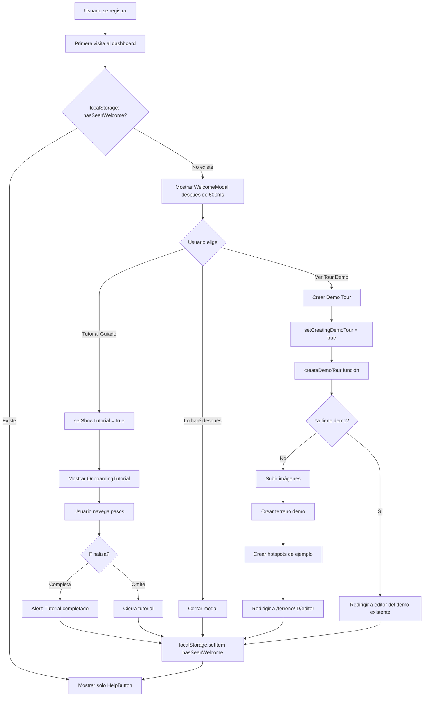

# 🎓 SISTEMA DE ONBOARDING TUTORIAL - PotentiaMX

**Fecha de implementación:** 19 de Octubre, 2025
**Objetivo:** Familiarizar rápidamente a nuevos usuarios con la plataforma
**Inspiración:** Pinterest-style onboarding

---

## 📋 RESUMEN EJECUTIVO

El sistema de onboarding tutorial está diseñado para reducir la curva de aprendizaje de nuevos usuarios mediante:

1. ✅ **Tutorial Guiado:** Paso a paso con flechas y tooltips
2. ✅ **Tour Demo Automático:** Tour precargado para probar funcionalidades
3. ✅ **Modal de Bienvenida:** Primera impresión profesional
4. ✅ **Botón de Ayuda:** Siempre visible, no invasivo

---

## 🎨 COMPONENTES CREADOS

### 1. **OnboardingTutorial.tsx**

Componente principal que renderiza el tutorial paso a paso.

**Ubicación:** `components/OnboardingTutorial.tsx`

**Props:**

```typescript
interface OnboardingTutorialProps {
  steps: TutorialStep[];
  onComplete: () => void;
  onSkip: () => void;
}

interface TutorialStep {
  target: string; // CSS selector (data-tutorial="nombre")
  title: string; // Título del paso
  description: string; // Descripción detallada
  position: 'top' | 'bottom' | 'left' | 'right';
}
```

**Características:**

- ✅ Highlight del elemento objetivo con animación pulse
- ✅ Overlay oscuro para enfocar atención
- ✅ Tooltip con título, descripción y progreso
- ✅ Navegación anterior/siguiente
- ✅ Barra de progreso visual
- ✅ Scroll automático al elemento
- ✅ Cálculo inteligente de posición del tooltip
- ✅ Z-index alto (9998-10000) para estar siempre visible

**Ejemplo de uso:**

```tsx
<OnboardingTutorial
  steps={dashboardTutorialSteps}
  onComplete={() => console.log('Tutorial completado')}
  onSkip={() => console.log('Tutorial omitido')}
/>
```

---

### 2. **WelcomeModal.tsx**

Modal de bienvenida mostrado en la primera visita.

**Ubicación:** `components/WelcomeModal.tsx`

**Props:**

```typescript
interface WelcomeModalProps {
  onStartTutorial: () => void;
  onViewDemo: () => void;
  onClose: () => void;
  userName?: string;
}
```

**Características:**

- ✅ Diseño moderno con gradiente teal-blue
- ✅ Dos opciones principales: Tutorial Guiado vs Tour Demo
- ✅ Personalización con nombre del usuario
- ✅ Opción de "Lo haré después"
- ✅ Animaciones suaves de entrada/salida
- ✅ Backdrop blur para mejor enfoque

**Flujo:**

1. Usuario se registra
2. Primera vez que entra al dashboard
3. Se muestra el modal de bienvenida
4. Usuario elige:
   - **Tutorial Guiado:** Inicia tutorial paso a paso
   - **Ver Tour Demo:** Crea y abre tour precargado
   - **Lo haré después:** Cierra modal, puede reabrir desde botón de ayuda

---

### 3. **HelpButton.tsx**

Botón flotante de ayuda siempre visible.

**Ubicación:** `components/HelpButton.tsx`

**Props:**

```typescript
interface HelpButtonProps {
  onStartTutorial: () => void;
  onViewDemo?: () => void;
}
```

**Características:**

- ✅ Posición fija (bottom-right)
- ✅ Icono de interrogación con efecto pulse
- ✅ Menú desplegable con opciones
- ✅ No invasivo (esquina inferior derecha)
- ✅ Z-index 40 (por debajo de modals pero sobre contenido)
- ✅ Animación hover (scale-110)

**Ubicación en pantalla:**

```
┌─────────────────────────────────┐
│                                 │
│         Dashboard               │
│                                 │
│                                 │
│                          ┌───┐  │
│                          │ ? │◄── Botón de ayuda
│                          └───┘  │
└─────────────────────────────────┘
```

---

### 4. **tutorialSteps.ts**

Configuración de pasos del tutorial para diferentes páginas.

**Ubicación:** `utils/tutorialSteps.ts`

**Exports:**

- `dashboardTutorialSteps` - Tutorial del dashboard principal
- `editorTutorialSteps` - Tutorial del editor de hotspots
- `addTerrainTutorialSteps` - Tutorial de agregar terreno

**Estructura de pasos del Dashboard:**

```typescript
export const dashboardTutorialSteps = [
  {
    target: '[data-tutorial="add-terrain-button"]',
    title: '¡Crea tu primer tour 360°!',
    description: 'Haz clic aquí para agregar un nuevo terreno...',
    position: 'bottom',
  },
  {
    target: '[data-tutorial="terrains-list"]',
    title: 'Tus propiedades',
    description: 'Aquí verás todas tus propiedades creadas...',
    position: 'top',
  },
  // ... más pasos
];
```

**Pasos actuales:**

1. Botón "Crear Tour 360°"
2. Lista de propiedades
3. Card de propiedad con acciones
4. Toggle de Marketplace

---

### 5. **createDemoTour.ts**

Utilidad para crear tour demo automático.

**Ubicación:** `utils/createDemoTour.ts`

**Funciones exportadas:**

#### `createDemoTour(userId: string): Promise<DemoTourResult>`

Crea un tour demo con imágenes precargadas y hotspots de ejemplo.

```typescript
interface DemoTourResult {
  success: boolean;
  terrainId?: string;
  error?: string;
}
```

**Proceso:**

1. Sube imágenes demo al storage (desde ruta local)
2. Crea terreno con `status: 'demo'`
3. Agrega hotspots de navegación de ejemplo
4. Retorna ID del terreno creado

**Configuración del demo:**

```typescript
const demoTerrain = {
  title: '🎓 Tour Demo - Terreno en Boca de Tomatlán',
  description: 'Tour de demostración para explorar funcionalidades...',
  total_square_meters: 5000,
  land_use: 'Residencial/Turístico',
  location: 'Boca de Tomatlán, Puerto Vallarta',
  sale_price: 2500000,
  property_type: 'terreno',
  is_marketplace_listing: false, // ❌ NO publicar
  status: 'demo', // Estado especial
};
```

#### `hasDemoTour(userId: string): Promise<boolean>`

Verifica si el usuario ya tiene un tour demo.

#### `deleteDemoTour(userId: string): Promise<boolean>`

Elimina el tour demo del usuario (limpieza opcional).

---

## 🔗 INTEGRACIÓN CON DASHBOARD

### Estado del Onboarding

```javascript
// Estados para Onboarding Tutorial
const [showWelcomeModal, setShowWelcomeModal] = useState(false);
const [showTutorial, setShowTutorial] = useState(false);
const [creatingDemoTour, setCreatingDemoTour] = useState(false);
```

### Detección de Primera Visita

```javascript
useEffect(() => {
  // Solo mostrar onboarding para usuarios NO admin
  if (isAdmin) return;

  const hasSeenWelcome = localStorage.getItem('hasSeenWelcome');
  if (!hasSeenWelcome && !loading && terrenos.length >= 0) {
    setTimeout(() => {
      setShowWelcomeModal(true);
    }, 500); // Esperar a que cargue el dashboard
  }
}, [isAdmin, loading, terrenos.length]);
```

### Atributos data-tutorial

Los elementos clave tienen atributos `data-tutorial` para que el tutorial los encuentre:

```jsx
<Link
  href="/dashboard/add-terrain"
  data-tutorial="add-terrain-button"
  className="..."
>
  Crear Tour 360°
</Link>

<div data-tutorial="terrains-list" className="grid ...">
  {terrenos.map((terreno, index) => (
    <div
      data-tutorial={index === 0 ? 'terrain-card' : undefined}
      className="..."
    >
      {/* Primera card tiene el atributo */}
    </div>
  ))}
</div>

<div
  data-tutorial={index === 0 ? 'marketplace-toggle' : undefined}
  className="..."
>
  {/* Toggle de marketplace */}
</div>
```

### Renderizado de Componentes

```jsx
{
  /* ✅ Onboarding Tutorial System */
}
{
  !isAdmin && (
    <>
      {/* Welcome Modal - Shown on first visit */}
      {showWelcomeModal && !creatingDemoTour && (
        <WelcomeModal
          onStartTutorial={handleStartTutorial}
          onViewDemo={handleViewDemo}
          onClose={handleCloseWelcome}
          userName={user?.user_metadata?.full_name}
        />
      )}

      {/* Tutorial with step-by-step guidance */}
      {showTutorial && (
        <OnboardingTutorial
          steps={dashboardTutorialSteps}
          onComplete={handleCompleteTutorial}
          onSkip={handleSkipTutorial}
        />
      )}

      {/* Help Button - Always visible */}
      <HelpButton
        onStartTutorial={handleStartTutorial}
        onViewDemo={handleViewDemo}
      />

      {/* Creating Demo Tour Overlay */}
      {creatingDemoTour && (
        <div className="fixed inset-0 z-50 ...">
          <div className="bg-white rounded-2xl ...">
            <div className="animate-spin ..."></div>
            <h3>Creando Tour Demo</h3>
            <p>Estamos preparando un tour de ejemplo...</p>
          </div>
        </div>
      )}
    </>
  );
}
```

---

## 📊 FLUJO DE USUARIO

### Flujo Completo - Primera Visita



### Flujo Simplificado

1. **Primera visita**
   - Dashboard carga
   - Después de 500ms → WelcomeModal aparece

2. **Usuario elige Tutorial Guiado**
   - OnboardingTutorial se muestra
   - Paso 1: Botón "Crear Tour 360°"
   - Paso 2: Lista de propiedades
   - Paso 3: Card de propiedad
   - Paso 4: Toggle Marketplace
   - Usuario completa u omite
   - localStorage.setItem('hasSeenWelcome', 'true')

3. **Usuario elige Ver Tour Demo**
   - Overlay "Creando Tour Demo" aparece
   - Se ejecuta createDemoTour()
   - Se crea terreno con status='demo'
   - Se agregan hotspots de ejemplo
   - Redirige a /terreno/[id]/editor
   - Usuario explora funcionalidades con datos reales

4. **Siguientes visitas**
   - Solo se muestra HelpButton (esquina inferior derecha)
   - Usuario puede reiniciar tutorial cuando quiera

---

## 🎯 DATA ATTRIBUTES REQUERIDOS

Para que el tutorial funcione, los elementos clave deben tener atributos `data-tutorial`:

### Dashboard

```jsx
// Botón principal de creación
<Link
  data-tutorial="add-terrain-button"
  href="/dashboard/add-terrain"
>
  Crear Tour 360°
</Link>

// Grid de propiedades
<div data-tutorial="terrains-list">
  {/* Grid de terrenos */}
</div>

// Primera card de terreno
<div data-tutorial="terrain-card">
  {/* Card de terreno */}
</div>

// Toggle de marketplace
<div data-tutorial="marketplace-toggle">
  <input type="checkbox" />
  Publicar en Marketplace
</div>
```

### Editor (Futuro)

```jsx
<div data-tutorial="panorama-viewer">
  {/* Visor 360° */}
</div>

<button data-tutorial="add-hotspot-mode">
  Modo Agregar Hotspot
</button>

<div data-tutorial="hotspots-list">
  {/* Lista de hotspots */}
</div>

<div data-tutorial="view-selector">
  {/* Selector de vistas */}
</div>

<button data-tutorial="save-button">
  Guardar Cambios
</button>
```

---

## 🗄️ ALMACENAMIENTO LOCAL

### localStorage Keys

| Key              | Valor    | Propósito                                           |
| ---------------- | -------- | --------------------------------------------------- |
| `hasSeenWelcome` | `'true'` | Indica que el usuario ya vio el modal de bienvenida |

**Importante:** Cuando el usuario completa el tutorial, omite el modal o crea el demo tour, se guarda este flag.

**Borrar onboarding manualmente:**

```javascript
// En consola del navegador
localStorage.removeItem('hasSeenWelcome');
// Recargar página para ver modal de nuevo
```

---

## 🔧 CONFIGURACIÓN ADICIONAL NECESARIA

### 1. Preparar Imágenes Demo

Las imágenes demo están ubicadas en:

```
C:\Users\Roberto\Desktop\Altha\Terrenos boca de tomatlan\imagnes para demo\
- DJI_20250930101122_0014_D.JPG
- DJI_20250930111615_0020_D.JPG
- DJI_20250930113100_0030_D.JPG
```

**Tarea pendiente:** Implementar endpoint de API para subir estas imágenes al storage de Supabase desde el servidor.

**Opción temporal:** Subir manualmente al bucket `tours-panoramicos` y hardcodear las URLs en `createDemoTour.ts`.

### 2. Modificar Esquema de Base de Datos

Agregar nuevo valor al enum de `status` en la tabla `terrenos`:

```sql
-- Agregar 'demo' como valor permitido
ALTER TABLE terrenos
DROP CONSTRAINT IF EXISTS terrenos_status_check;

ALTER TABLE terrenos
ADD CONSTRAINT terrenos_status_check
CHECK (status IN ('active', 'pending_approval', 'rejected', 'demo', 'draft'));
```

### 3. RPC Function para Update Hotspots

Asegurarse de que la función `update_hotspots_for_terrain` existe:

```sql
-- Esta función ya debería existir de implementaciones anteriores
-- Verifica en Supabase SQL Editor
SELECT proname FROM pg_proc WHERE proname = 'update_hotspots_for_terrain';
```

---

## 🎨 ESTILOS Y DISEÑO

### Z-Index Hierarchy

```
10000 - OnboardingTutorial tooltip
9999  - OnboardingTutorial element highlight
9998  - OnboardingTutorial overlay
50    - WelcomeModal
40    - HelpButton
30    - (reserved)
```

### Colores del Sistema

| Componente              | Color Principal | Gradiente                   |
| ----------------------- | --------------- | --------------------------- |
| WelcomeModal            | Teal-Blue       | `from-teal-500 to-blue-600` |
| OnboardingTutorial      | Teal            | `bg-teal-500`               |
| HelpButton              | Teal-Blue       | `from-teal-500 to-blue-600` |
| Tutorial Guiado (botón) | Teal            | `bg-teal-500`               |
| Ver Demo (botón)        | Purple          | `bg-purple-500`             |

### Animaciones

- **Pulse:** Element highlight durante tutorial
- **Fade-in + Zoom-in:** Tooltip del tutorial (300ms)
- **Slide-in-from-bottom:** Menú del HelpButton (200ms)
- **Spin:** Loading del demo tour
- **Scale:** Hover del HelpButton (110%)

---

## 🧪 TESTING

### Casos de Prueba

#### 1. Primera Visita - Modal de Bienvenida

**Pasos:**

1. Borrar localStorage: `localStorage.removeItem('hasSeenWelcome')`
2. Registrar nuevo usuario o recargar dashboard
3. Esperar 500ms

**Resultado esperado:**
✅ WelcomeModal aparece con saludo personalizado
✅ Opciones "Tutorial Guiado" y "Ver Tour Demo" visibles
✅ Opción "Lo haré después" disponible

#### 2. Tutorial Guiado Completo

**Pasos:**

1. Click en "Tutorial Guiado"
2. Navegar todos los pasos con "Siguiente"
3. Click en "Finalizar" en último paso

**Resultado esperado:**
✅ Cada paso muestra el elemento correcto highlighted
✅ Tooltip se posiciona correctamente
✅ Barra de progreso actualiza
✅ Al finalizar: alert "Tutorial completado"
✅ localStorage.setItem('hasSeenWelcome', 'true')

#### 3. Tutorial Omitido

**Pasos:**

1. Click en "Tutorial Guiado"
2. Click en "Saltar tutorial" o la X

**Resultado esperado:**
✅ Tutorial se cierra
✅ localStorage.setItem('hasSeenWelcome', 'true')

#### 4. Ver Tour Demo

**Pasos:**

1. Click en "Ver Tour Demo"
2. Esperar creación

**Resultado esperado:**
✅ Overlay "Creando Tour Demo" aparece
✅ Se crea terreno en BD con status='demo'
✅ Se crean 3 hotspots de ejemplo
✅ Redirige a /terreno/[id]/editor
✅ localStorage.setItem('hasSeenWelcome', 'true')

#### 5. Botón de Ayuda - Reiniciar Tutorial

**Pasos:**

1. Completar onboarding (localStorage.hasSeenWelcome = 'true')
2. Click en botón "?" esquina inferior derecha
3. Click en "Tutorial Guiado"

**Resultado esperado:**
✅ Tutorial inicia de nuevo
✅ Todos los pasos funcionan correctamente

#### 6. Botón de Ayuda - Ver Demo Existente

**Pasos:**

1. Ya tener un tour demo creado
2. Click en "?" → "Ver Tour Demo"

**Resultado esperado:**
✅ Detecta que ya existe demo
✅ Redirige al editor del demo existente
✅ NO crea nuevo demo

---

## 📈 MÉTRICAS DE ÉXITO

### KPIs a Monitorear

1. **Tasa de Completitud de Tutorial**
   - % de usuarios que completan vs omiten

2. **Tasa de Uso de Demo Tour**
   - % de usuarios que eligen "Ver Tour Demo"

3. **Tiempo Promedio en Tutorial**
   - Cuánto tiempo toma completar los 4 pasos

4. **Retención Post-Onboarding**
   - % de usuarios que crean un tour real después del onboarding

5. **Uso del Botón de Ayuda**
   - Cuántas veces se reinicia el tutorial

### Tracking (Futuro)

Agregar eventos de Google Analytics:

```javascript
// Ejemplo con GA4
gtag('event', 'onboarding_started', {
  method: 'tutorial_guided',
});

gtag('event', 'onboarding_completed', {
  method: 'tutorial_guided',
  step_reached: 4,
});

gtag('event', 'demo_tour_created', {
  user_id: user.id,
});
```

---

## 🔄 PRÓXIMOS PASOS

### Implementación Inmediata

1. **Subir Imágenes Demo** ⏳
   - Crear endpoint de API para subir imágenes del servidor
   - O subir manualmente al storage de Supabase
   - Hardcodear URLs en `createDemoTour.ts`

2. **Testing Completo** ⏳
   - Probar todos los casos de prueba listados arriba
   - Verificar en diferentes navegadores
   - Probar en móvil

3. **Ajustar Status Enum** ⏳
   - Agregar 'demo' al constraint de status
   - Verificar RPC functions

### Futuras Mejoras

4. **Tutorial del Editor** 📝
   - Agregar tutorial para la página de editor de hotspots
   - Usar `editorTutorialSteps` de `tutorialSteps.ts`

5. **Tutorial de Add Terrain** 📝
   - Tutorial para agregar nuevo terreno
   - Usar `addTerrainTutorialSteps`

6. **Analytics Integration** 📝
   - Google Analytics events
   - Hotjar recordings
   - Mixpanel tracking

7. **A/B Testing** 📝
   - Probar diferentes textos de onboarding
   - Probar diferentes flujos
   - Optimizar tasa de completitud

8. **Video Tour** 📝
   - Agregar opción de video tutorial
   - Integrar con YouTube/Vimeo

9. **Gamification** 📝
   - Achievements por completar tutorial
   - Progreso visual
   - Rewards

---

## 🐛 TROUBLESHOOTING

### Problema: Modal no aparece en primera visita

**Solución:**

1. Verificar localStorage: `localStorage.getItem('hasSeenWelcome')`
2. Si es `'true'`, borrar: `localStorage.removeItem('hasSeenWelcome')`
3. Recargar página

### Problema: Tutorial no encuentra elemento

**Error:** `Tutorial: No se encontró elemento [data-tutorial="nombre"]`

**Solución:**

1. Verificar que el elemento tiene el atributo `data-tutorial`
2. Verificar que el selector en `tutorialSteps.ts` coincide
3. Verificar que el elemento está renderizado (no hidden)

### Problema: Demo tour no se crea

**Solución:**

1. Verificar console logs
2. Verificar que las imágenes están subidas al storage
3. Verificar constraint de status en BD
4. Verificar función RPC `update_hotspots_for_terrain`

### Problema: Botón de ayuda no aparece

**Solución:**

1. Verificar que el usuario NO es admin (isAdmin = false)
2. Verificar z-index del botón (debe ser 40)
3. Verificar que no hay otros elementos encima

---

## 📚 REFERENCIAS

- **Inspiración:** Pinterest onboarding flow
- **Componentes:** Tailwind CSS + Lucide Icons
- **Tecnología:** Next.js 15, React 19, TypeScript
- **Backend:** Supabase (Auth, DB, Storage)

---

## ✅ CHECKLIST DE IMPLEMENTACIÓN

- [x] Componente OnboardingTutorial.tsx creado
- [x] Componente WelcomeModal.tsx creado
- [x] Componente HelpButton.tsx creado
- [x] Utilidad createDemoTour.ts creada
- [x] Configuración tutorialSteps.ts creada
- [x] Integración con dashboard completada
- [x] Data attributes agregados
- [x] Estado de onboarding manejado
- [x] localStorage configurado
- [ ] Imágenes demo subidas a Supabase
- [ ] Status enum actualizado en BD
- [ ] Testing completo realizado
- [ ] Tutorial del editor implementado
- [ ] Tutorial de add terrain implementado
- [ ] Analytics integrado

---

**Implementación:** 19 de Octubre, 2025
**Desarrollador:** Roberto (Solo Founder)
**Proyecto:** LandView App CMS (PotentiaMX)
**Estado:** ✅ Implementado (Pendiente: Subir imágenes demo y testing)
